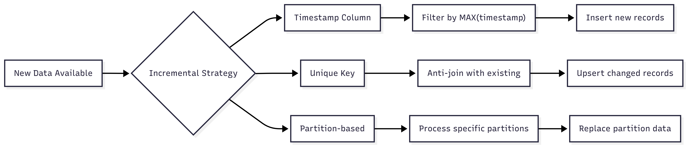

<!-- _color: "rgb(31,56,94)" -->

# Analytics Engineering 
# Session 11: Advanced Materializations: Incremental & Snapshots

---

## Agenda

- Incremental Models
- Incremental Strategies
- Snapshots (SCD Type 2)
- Q&A

---

## Incremental Models

For large tables, rebuilding from scratch every time is too slow/expensive.

**Incremental**: Only process new or changed data.

```sql
{{
    config(
        materialized='incremental',
        unique_key='order_id'
    )
}}

select * from raw_orders

  where order_date > (select max(order_date) from {{ this }})

```

---

## Incremental Strategies

How dbt updates the destination table.

- **append**: Just add new rows (duplicates possible).
- **merge**: Update existing rows, insert new ones (requires `unique_key`).
- **delete+insert**: Delete rows that match, then insert.

---

## Snapshots (SCD Type 2)

Track changes to mutable data over time.

- **Source**: `users` table where `email` changes.
- **Snapshot**: Keeps history.
  - `dbt_valid_from`: When the record started.
  - `dbt_valid_to`: When it ended (null if current).

Defined in `snapshots/` folder (SQL file with `` block).

---

## What have we achieved in this session

- Convert a large table model to incremental
- Create a snapshot for a mutable source
- Test incremental logic

**Next Session:** Debugging & Troubleshooting.

- Full refreshes become slow with large tables
- Resource intensive for frequent updates
- Costly in cloud data warehouses

### The Solution

- Process only new/changed data
- Maintain historical context
- Reduce compute costs

---

## Incremental Model Strategies

### Timestamp-based

```sql
{{ config(materialized='incremental') }}

select *
from {{ source('ecommerce', 'orders') }}

  where order_date > (select max(order_date) from {{ this }})

```

---

### Unique Key-based
```sql
{{ config(
  materialized='incremental',
  unique_key='order_id'
) }}

select *
from {{ source('ecommerce', 'orders') }}

  where order_id not in (select order_id from {{ this }})

```

`{{ this }}` is a reference to the current model being built.

---

## Incremental Model Patterns



---

## Handling Edge Cases

### Late-arriving Data

```sql
-- lookback window for late data

  where order_date > dateadd(day, -7, (select max(order_date) from {{ this }}))

```

---

### Schema Changes

```sql
-- handle new columns gracefully
{{ config(
    materialized = 'incremental',
    unique_key = 'id',
    on_schema_change = 'sync_all_columns'  -- or 'ignore', 'fail', 'append_new_columns'
) }}
```

- `ignore` - Do nothing, keep existing schema
- `fail` - Error out if schema has changed
- `append_new_columns` - Add new columns to the existing schema
- `sync_all_columns` - Align schema with source, adding/removing columns as needed

---

## Snapshots in dbt

Snapshots capture and store historical versions of records over time.

### When to Use Snapshots

- Slowly changing dimensions (Type 2 SCD)
- Audit trails for compliance
- Point-in-time analysis

---

## Basic Snapshot

```sql


{{
  config(
    target_schema='snapshots',
    unique_key='customer_id',
    strategy='timestamp',
    updated_at='updated_at'
  )
}}

select * from {{ source('ecommerce', 'customers') }}


```

---

## Basic Snapshot

The basic snapshot is taking a source table and storing its state over time based on changes in a specified column (e.g., `updated_at`).

We can use this to track changes in customer information over time.

---

## Snapshots vs Incremental Models

| Aspect | Incremental Models | Snapshots |
|--------|-------------------|-----------|
| **Use Case** | Fact tables, events | Dimension tables, history |
| **Performance** | Fast, targeted updates | Slower, full comparisons |
| **Storage** | Current state only | Historical versions |
| **Complexity** | Higher (custom logic) | Lower (dbt handles) |
| **Cost** | Lower (less processing) | Higher (version storage) |

---

## Best Practices

| Monitoring | Testing | Maintenance |
|------------|---------|-------------|
| Track incremental processing time | Test incremental logic separately | Regular cleanup of old snapshots |
| Monitor data freshness | Validate data consistency | Monitor storage costs |
| Alert on processing failures | Check for duplicates or gaps | Plan for schema evolution | 
